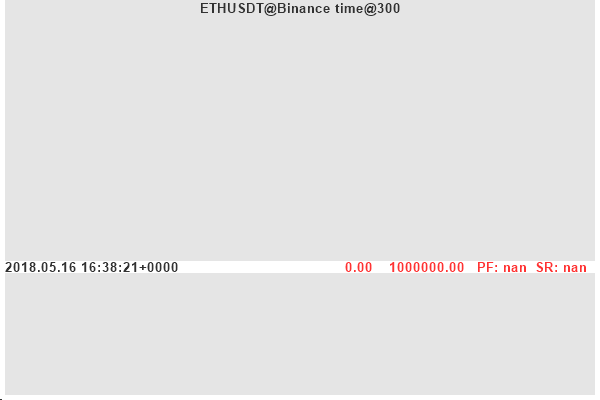
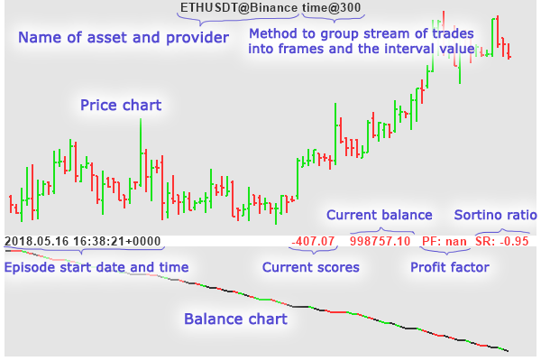

<a rel="license" href="http://creativecommons.org/licenses/by-nc-sa/4.0/">
</a>
<br />
<span xmlns:dct="http://purl.org/dc/terms/" property="dct:title">
Intraday Exchange Gym Environment</span> by
<a xmlns:cc="http://creativecommons.org/ns#" href="https://github.com/diovisgood/intraday" property="cc:attributionName" rel="cc:attributionURL">Pavel B. Chernov</a>
is licensed under a <a rel="license" href="http://creativecommons.org/licenses/by-nc-sa/4.0/">
Creative Commons Attribution-NonCommercial-ShareAlike 4.0 International License</a>

# Intraday

This package provides gym compatible environment to **simulate intraday trading**
based on stream of trades, either historical or real-time.

This project was inspired by [TensorTrade](https://github.com/tensortrade-org/tensortrade),
but it was written from scratch, and it is a completely original source code.

The main idea is to go deeper from candles to the actual stream of trades.

It has several advantages:

1. Simulates order *delays*, like in the real life.
2. Takes into account bid-ask *spread*, when executing market orders.
3. Some limit orders are not executed even if price *touches* them, like in the real life. (Read below for explanation).
4. Supports *multiple agents* running the same episode.
5. Supports *idle penalty* to stimulate agents to perform actions and not just hold the initial balance.
6. Liquidates agent account when it goes *bankrupt* (like in the real life).

It provides you with:

- Gym compatible environment.
- Real exchange simulation under the hood.
- Different methods to split stream of trades into frames:
  - by time interval (as usual)
  - by traded volume
  - by number of trades (a.k.a. ticks)
- Different actions schemes, including the most popular one: `{Buy, Sell, Close}`.
- Support for many popular order types (it means you can easily write any desired action scheme):
  - MarketOrder
  - LimitOrder
  - StopOrder
  - TrailingStopOrder
  - TakeProfitOrder
- Support for different reward schemes.
  The most obvious one is: `BalanceReward`, which can be automatically scaled with computed
  [**ATR**](https://en.wikipedia.org/wiki/Average_true_range) value.
  Also there is: `ConstantReward`.
- Support for many popular features and indicators:
  - ADL
  - CMF
  - Cumulative Sum
  - Efficiency Ratio
  - EMA
  - EOM
  - Fractals
  - Fractal Dimensions
  - Heiken Ashi
  - KAMA
  - OBV
  - Parabolic SAR
  - etc.
- Two Binance providers: `BinanceArchiveProvider` and `BinanceKlines`.
- Trades simulation, if for some reason you only have candles.
- Enhanced evaluation of agent trading performance:
  - roi
  - sharpe ratio
  - profit factor
  - sortino ratio
  - etc.


## Installation

1. Download package
2. Cd into directory
3. Execute:
```bash
python setup.py install
```

### Quick start

Here is a simple script to run 

```python
from datetime import date, timedelta
from intraday.providers import BinanceArchiveProvider
from intraday.processor import IntervalProcessor
from intraday.features import EMA, Copy, PriceEncoder
from intraday.actions import BuySellCloseAction
from intraday.rewards import BalanceReward
from intraday.env import SingleAgentEnv

provider = BinanceArchiveProvider(data_dir='.', symbol='ETHUSDT',
                                  date_from=date(2018, 5, 1), date_to=date(2018, 5, 31))
processor = IntervalProcessor(method='time', interval=5*60)
period = 1000
atr_name = f'ema_{period}_true_range'
features_pipeline = [
    PriceEncoder(source='close', write_to='both'),
    EMA(period=period, source='true_range', write_to='frame'),
    Copy(source=['volume'])
]
action_scheme = BuySellCloseAction()
reward_scheme = BalanceReward(norm_factor=atr_name)
env = SingleAgentEnv(
    provider=provider,
    processor=processor,
    features_pipeline=features_pipeline,
    action_scheme=action_scheme,
    reward_scheme=reward_scheme,
    initial_balance=1000000,
    warm_up_time=timedelta(hours=1)
)

state = env.reset()
while True:
    env.render('human')
    print(state)
    action = action_scheme.get_random_action()
    state, reward, done, frame = env.step(action)
    if done:
        break
        
env.close()
```

You should see something like this:



### Screen explained

Here is some explaination of different values on this screen:



Note that in the code above agent performed random actions,
that is why balance chart is constantly decreasing.

By the way, notice different colors on the balance line?
Each color describes a position agent was at that moment:

- Green: agent was in long position.
- Red: agent was in short position.
- Black: agent was not in position.


## Advantages

It tries to simulate trading environment as realistically as possible.
A lot of trained models seem to perform good during training, but often fail to show
any positive result in real trading. Mainly because they ignore following issues.

### Order delays from agent to exchange

There is always a delay between the moment agent makes its decision and the
moment order reaches an exchange, due to network or exchange delays.
Typically, about 1..3 seconds.
This package allows you to specify it explicitly in `agent_order_delay` argument.

### Order delays from broker to exchange or inside exchange

For some kind of orders like: `TakeProfitOrder` or `StopOrder` there is a small internal delay
between the moment broker/exchange server decides to execute this order by placing the `MarketOrder`
and the moment when `MarketOrder` reaches an exchange. Typically, about 0.5...1 seconds.
This package allows you to specify it explicitly in `broker_order_delay` argument.

### Realistic bid-ask spread

When agent wants to buy or sell immediately it issues a `MarketOrder`.
This order should be executed by the best price which is available there in the order book.
But there is always a gap between best bid and best ask price, which is often ignored.

Imagine a situation: the last trade was a `sell at a price 103.5`,
and agent decides it should buy immediately.
But it can't buy at this price, since it was a sell trade, which was executed at the **best bid price**.
While buy order will be executed at **best ask price**.
The best ask price is typically higher than best bid price, say, for example: 104.0 (thus the spread is: 0.5)

We don't have order book since this is a simulated Exchange environment.
But this package analyzes the stream of buy and sell trades and estimates the mean and std
values for the bid-ask spread. It then uses the upper estimation of spread to choose
the realistic price for `MarketOrder` to be executed.

### Limit orders execution

Another issue is with limit orders. Sometimes limit orders are not executed even if price *touches* them.
Simply because they were last in the order book and there were not enough corresponding market buy(sell)
orders to fulfill them.
This package lets you specify explicitly the probability for limit order to be executed in such scenario,
via `order_luck` argument.

### Support for multiple agents

Unlike most gym environments this package is able to run multiple agents on the same episode.
It does this by allocating different virtual broker's accounts for each agent.
So each agent has its own `initial_balance` and can perform its own trades.
This can be useful for some optimization algorithms like: Evolutions Strategies, CMA-ES, etc.

### Support for idle penalty

When trained in complicated stochastic environments agents often tend to **do nothing**.
This is a simple way to save its life or money balance.
A simple solution to the problem is to introduce some penalty for agent for being idle.

Thus its balance will slightly decrease on each step even if it did not open long or short position.
This decrease is equal to the price range of the current frame multiplied by `idle_penalty` parameter.

### Liquidation of agent account when it goes bankrupt

In reality, in most cases, exchange will block your account if your balance becomes negative.
This means you can no longer buy or sell assets.

Maybe this is not very useful for the aim of agent training.
I suggest a better approach would be to let it make mistakes at the beginning of learning.
And after some time, as it matures, bring some real constraints.

This could easily be achieved by specifying very large `initial_balance` at the start of training.
And then reduce it to some realistic values over time.

### Support for any kind of data providers


## TODO

1. Not all `features/*.py` have corresponding unit-tests. Ideally, each feature should have good unit-testing.
2. dfd
